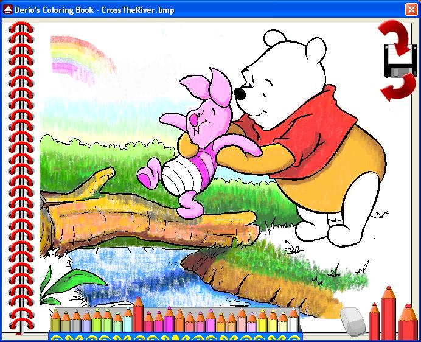



## Derio's Coloring Book

### Description

You can create your own object using Visual Basic easily. Just create a picture of the object using Paint, put it on ActiveX Control, setup backstyle to 0, setup the mask color and set the picture as the mask picure, and whoop, you got the passionate object. So, you can easily create the pencil, the pencil box, the eraser, the binder, etc. Then you play with them on the picturebox with some template image on it, you get the Coloring Book! That's the idea ...
 
### More Info
 

             |
---                |---
**Submitted On**   |2008-02-11 15:26:00
**By**             |[Derio](https://github.com/Planet-Source-Code/PSCIndex/blob/master/ByAuthor/derio.md)
**Level**          |Intermediate
**User Rating**    |5.0 (40 globes from 8 users)
**Compatibility**  |VB 6\.0
**Category**       |[Miscellaneous](https://github.com/Planet-Source-Code/PSCIndex/blob/master/ByCategory/miscellaneous__1-1.md)
**World**          |[Visual Basic](https://github.com/Planet-Source-Code/PSCIndex/blob/master/ByWorld/visual-basic.md)
**Archive File**   |[Derio's\_Co2101542122008\.zip](https://github.com/Planet-Source-Code/derio-derio-s-coloring-book__1-70085/archive/master.zip)

